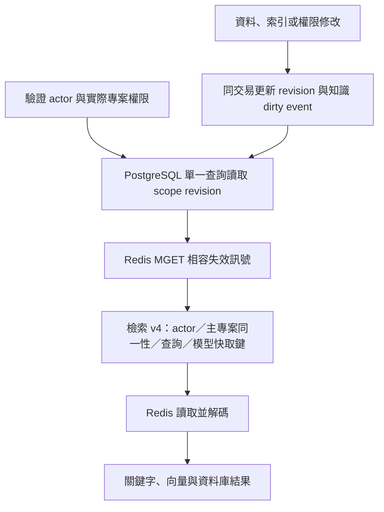

# 快取一致性與觀測

本設計維持 Redis cache-aside 與 PostgreSQL 權威資料的分工。快取命中率需要與查詢重複率、資料修改頻率、背景流量及來源負載一起解讀；不同期間或母體的百分比不可直接比較。

## 讀寫路徑

- `search-final`、`working-context-final`、`semantic-hits` 使用 v4 檢索鍵；Dashboard memory、details 與 logs 使用 v3 鍵。Embedding 仍以模型、用途與完整文字決定，可跨資料 revision 重用。既有 TTL 不變：最終結果 15 分鐘、semantic hits 10 分鐘、query embedding 24 小時；命中不延長 TTL。
- actor identity 採結構化序列化，包含 tenant、user、role、service/interactive/authenticated 狀態、有效 scopes 與 grants。Session ID 不影響內容，因此不作為易變的 key dimension。ProjectId 在資料與回應中保留原始寫法；檢索、授權引用與快取鍵使用相同的固定同一性契約，`TT`、`Tt`、`tT`、`tt` 視為同一專案。集合順序與重複項目不影響 key；tenant、user、principal、resource、permission、查詢文字與模型鍵仍遵守各自的契約。完整規則見 [Project identity](project-identity-contract.md)。
- Working context 額外包含 primary project。`SummaryOnly` 的檢索來自 shared，但主專案的 metadata/log 仍須先授權，並將主專案 revision 納入 stamp。維護狀態每次重新讀取；既有 recent-log 快照依 context TTL 更新，runtime logs 不會引發每筆全專案失效。
- 成功反序列化、必要欄位與集合元素有效且非 null 才算 hit；空陣列有效。格式錯誤和 null 算 `InvalidPayload`，與 Redis transport error、miss、bypass 分開。取消會向呼叫端傳遞。
- production DI 必須提供 `DurableCacheRevisionStore`；Redis-only fallback 只供直接建構的相容測試使用。版本未知或 PostgreSQL 無法讀取時，讀取失敗，不以未知 stamp 重用快取。
- 未指定 project 的 Dashboard 清單以全部現存 project revisions 及新增 scope 作為 catalog stamp；明細先查核目前 owner/project，再讀該 project stamp。這些 consumer 不依賴 reindex 的 global bump。

## 失效矩陣

| 修改 | 同交易失效範圍 |
| --- | --- |
| Memory 新增、更新、封存、刪除、metadata、project lifecycle | 所屬 project |
| Memory 搬移 | 原 project 與目標 project |
| Chunk 或 vector 完成、取代、刪除 | 關聯 Memory 的 project；與資料 commit 分別生效 |
| Link 新增、修改、刪除，包括跨專案 | 兩端 project |
| Governance finding 新增、狀態或關聯修改、刪除 | 原／新 primary 與 secondary Memory 的 project |
| Source connection 修改 | 所屬 project |
| User preference | project:user 及 tenant/user scope |
| Shared summary | project:shared |
| 租戶、帳號、token grants、project policy/grants/topology | security；忽略 token 使用時間與登入時間更新 |
| 明確全域模型或 schema/ranking 變更 | 新模型/key namespace、必要 reindex，或明確 global bump |

Migration 053 建立 `cache_scope_revisions` 與資料庫 trigger，涵蓋 EF 與直接 SQL。每個交易內同 scope 合併為一次 revision；rollback 同時回滾資料、revision 與事件。知識 dirty event 沿用 `audit.authority_outbox_events`，只含 scope 與 revision，不含原始內容或 credentials。

讀取使用一次 SQL 取得同一 committed snapshot 的所有相關版本，再以一次 Redis MGET 合併既有顯式失效訊號。業務流程的版本通知維持 Redis 訊號，避免在外層交易未提交時以另一條 DB connection 等待自己的 revision row lock；真正的資料失效由同交易 trigger 保證。Redis 訊號無法讀取時使用不可重用的 stamp，降級回來源。單筆 reindex 不再增加 global；Redis 中斷、重啟或回存舊 Redis revision 不會恢復舊資料的有效性。與讀取同時發生的提交可能使正在進行的請求返回其讀取起點的內容，但提交完成後啟動的新請求會取得新 revision。既有 key 留至 TTL 自行淘汰，不需清空 Redis。

既有 `project:<原始寫法>` revision rows 保留，不改寫或重設。讀取時以固定的 .NET／SQL ProjectId 同一性規則，在同一 committed snapshot 加總所有大小寫別名的 revisions；不能取最大值取代加總。失效訊號與有效 cache scope 也使用相同規則，不依賴 PostgreSQL locale lower。Scope 以 project 為單位，同名 project 在不同 tenant 的修改會保守地共同失效；結果仍以 tenant/user/actor 隔離。這個選擇增加少量失效，避免在既有全域 graph 和 legacy consumer 尚未完整切分時引入第二套 tenant revision 規則。版本 row 會序列化同 scope 的並行 writer，須在正式負載驗收觀察等待時間。

## 圖譜刷新

Migration 054 保存可重建的 global graph projection、revision checkpoint、lease 與 generation。Redis 仍保存其他 Dashboard snapshot；Graph adapter 從 PostgreSQL 讀取已完成 publication 的 snapshot，避免 DB lease 與 Redis SET 之間的跨庫發布空窗。

- 所有 scheduled、worker-event、manual 路徑採同一 global scope、同一內部 service actor，離開後恢復呼叫者身分。對外手動入口保留 admin 授權。
- 同 scope 只取得一個有效 lease。Lease 5 分鐘、build deadline 4 分鐘；publication 在交易內重查 revision 與 generation/token/expiry。取消、失敗或過期不清除 dirty revision；下一次可重試。
- 無修改時只檢查 revision，不重建或執行 similarity search。24 小時到期、初建、受控 manual 或全域版本改變時 full reconcile。
- 增量重算 dirty project 的 similarity sources，並處理 global top-160 選入／移除的來源。無邊來源也保存已選清單。節點 metadata 與 explicit edges 仍讀取完整 scope；此處的增量是昂貴的 similarity 部分，並非所有 metadata 均已分片。
- 以 revision ledger 的最新 scope 狀態追蹤 dirty，避免將 outbox sequence 配置次序當成交易 commit 次序而漏事件。畫面提供 generation、mode、dirty age、lease active、skip、dedup、失敗與最後成功時間；60 秒為 stale 提示，不是已證明的 Production SLA。

## Redis 故障時的讀取降級

單次搜尋、working context 的結果快取流程與一次 Graph 重建，各自建立可丟棄快取的操作範圍；巢狀搜尋共用該範圍。首次 Redis 連線失敗或 timeout 後，這次操作的後續物件快取 GET/SET 與 invalidation signal 讀取會 bypass，避免每一層、每個 Graph 節點重複等待同一故障。下一次操作重新嘗試 Redis，不保存跨請求的故障狀態。

每次版本讀取仍先取得 PostgreSQL 的 committed revision；資料庫不可用時維持 fail-closed。未取得 Redis signals 時沿用不可重用的 unknown-signals stamp，不以舊版本或舊物件換取速度。授權、actor/project/tenant/owner 過濾、cache key、Graph lease/generation 與原 timeout 不變。

真正嘗試而失敗的物件快取操作計為 error，未嘗試的計為 bypass；signals 的 MGET 不納入物件快取 error counter。JSON、payload validation、序列化與 Redis command error 不會標記整個操作離線。Caller cancellation 優先傳遞，即使已 bypass 仍會拋出；已在途的並行 Redis 操作不會被這個旗標取消。

這項降級只涵蓋可丟棄快取，不改 locks、job signals、寫入失效通知或維護協調契約。Working context 在結果快取之前仍有維護協調等依賴，因此不代表整條 working context 流程在 Redis 故障下皆可用。原始 DB 與 embedding 負載可能增加，須以同流量與實際故障測試評估，不能只用 bypass 比例或單一合成圖的耗時宣稱 Production SLA。

## 圖譜畫布

「適應視圖」以可見節點、完整標題及連線的實際 SVG 範圍計算縮放與中心，包含線條寬度，不把空白布局畫布或透明點擊區域當作顯示內容。資料、字級或視窗尺寸改變時會重新量測；使用者已平移或縮放後保留其視角，直到再次操作「適應視圖」。完整入框可能需要低於一般縮放下限的比例，之後「縮小」仍會降低比例。

窄畫布將控制列移到繪圖區外並保留至少 44px 的操作按鈕。窄畫布或原有標題發生碰撞時，多節點的完整標題排列於獨立一列，以輔助連線對應原節點；節點位置、原始資料與關聯不變。較寬的畫布在原有標題不再碰撞時恢復原有標題位置。可直接點選可見標題或節點，或以鍵盤聚焦節點後按 Enter 開啟明細。密集圖的完整入框不保證所有標題都能閱讀，仍需放大與平移。

瀏覽器驗證須區分透明 SVG anchor 的外接矩形與實際可點選圖形；外接矩形中心可能落在空白區。選取驗證應點擊可見標題或節點，並比對所選節點 ID 與 API 完整內容，不以標題前綴推定選取正確。

## 監控母體與資料完整性

Migration 055 的分鐘聚合以 `instance + boot + UTC minute + kind + traffic class` 為唯一鍵。程序內 staging 上限 4096 buckets，每 15 秒 flush；資料庫 upsert 寫入累計值並以 revision 拒絕舊快照，重送不重複加總。程序重啟產生新 boot，instance 顯示不可逆 opaque identifier。

| 母體 | 解讀 |
| --- | --- |
| final-result / interactive | 最外層互動檢索；不含 nested seed search 或 Graph |
| cache kind / traffic class | 應用層實際 lookup；不可加總當使用者 request 數 |
| final-result / graph-background | 背景圖譜流量，使用聚合而不逐次同步寫 raw retrieval rows |
| origin-search / origin-context / origin-semantic / origin-embedding | 各層實際開始回來源的次數，含後續失敗；不混入 hit rate，不可相加視為使用者數或 SQL 次數 |
| Redis keyspace | Redis 自身自啟動累計，含其他資料用途 |
| PostgreSQL buffer | DB page buffer 指標，與應用結果命中率不同 |

期間限定 `24H、3D、7D、14D、30D`，使用完整 UTC 分鐘 `[start,end)`；當前未完成分鐘延後納入，畫面轉換本地時間。命中率為 `sum(hits) / sum(hits + misses)`，無判定樣本顯示「無樣本」；invalid、error、bypass 各自列出，不能藏在高命中率之下。

`query-compute` 沿用檢索服務的計算量測點；`telemetry-write` 包含該遙測方法的等待；`server-request` 在 HTTP response completed 後記錄，包含序列化與 telemetry，但包含非檢索 API/MCP transport，且不等於 client round trip。三者不相加，不從均值捏造 p95/p99。

已知丟棄、heartbeat 缺口、歷史起點不足或未正常結束顯示 Partial。`Observed` 只表示已看到的程序有觀測，`ExpectedInventoryStatus=Unknown` 明示沒有部署副本 inventory 的權威，因此不代表所有預期副本皆完整。異常結束前未 flush 的損失未知；15 秒是正常 flush interval，不是故障情境的遺失上界。已落盤的 pending/drop 數值也不是失聯程序的即時數值。

安全、MCP tool-call 與業務 authority audit 保持原有 durable 路徑，不走可丟棄聚合。既有互動 retrieval 品質資料繼續保存；Graph 新流量以聚合為準，歷史 raw retention 不變。此開發不刪除舊資料、不更改 retention、不執行 VACUUM 或 Redis flush。

## 發布與回退

共用 background run、Projection freshness、唯讀容量檢查及驗收重跑方式見[背景工作與監控契約](background-observability-contract.md)。

1. 遷移採 additive forward-only；053–056 不取代任何已發布 migration，052 保留給獨立治理變更。先驗 migration replay 與完整 solution，再由正式 main release 流程發布。056 另須通過所有權威範圍的同一性 collision preflight，並評估 functional indexes 的建置時間、額外容量、WAL 與鎖定成本。
2. 新舊 API 混用時，Dashboard 對缺少 endpoint 顯示未支援或未知。舊程序無法解讀 durable revision，因此正式切換須協調 reader/worker rollout；不能允許舊 reader 持續供應舊 key 並聲稱已取得新一致性保證。
3. 回退 build 必須保留 actor isolation、ProjectId 同一性與 durable revision；必要時停用最終物件快取降級，不回退到已知不安全的舊 key。不刪除 revision、outbox 或 audit schema。056 啟用別名寫入後，舊版 exact-selector reader 可能看不到已接受的資料，不能只更換舊映像回退；必須使用相容的 forward fix，或經核准的整庫復原與新增寫入對帳。相容讀者切換及正式備份／復原須另行驗證。
4. 正式驗收分開記錄 release SHA、部署健康、authenticated API/UI、MCP host 與同流量負載比較。本機 fixture 與多 coordinator 測試不是 Production 效能或 fresh host 驗收。

Dashboard 發布映像另須通過 `tools/deployment/tests/Test-DashboardPublishedAssets.ps1 -ImageId <sha256 image ID>`。它在無網路、無對外埠、無正式憑證的隔離容器中檢查發布 manifest，並實際驗證 Blazor bootstrap 的一般與 fingerprinted URL 回傳 200。此檢查可攔截 .NET 10 在 Razor 原始檔尚未複製時 restore、再以 `--no-restore` publish 而漏掉 framework assets 的問題；登入頁與 health 成功不能代替瀏覽器互動初始化。Dockerfile 在 restore 前保留 `App.razor`，讓 SDK 正確還原所需資源。發布後仍須以具管理頁面權限的測試帳號完成 authenticated UI 驗收。

讀取版本合併為一次 PostgreSQL statement 與一次 Redis MGET，避免逐專案 Redis round trip。Single-flight 僅在同 key 併發 origin duplication 的量測證明效益後才導入；目前優先消除 Graph 的重複工作與錯誤全域失效，以免多加一套取消與生命週期規則。

實作依據：[PostgreSQL trigger transaction semantics](https://www.postgresql.org/docs/17/trigger-definition.html)、[PostgreSQL CREATE TRIGGER](https://www.postgresql.org/docs/17/sql-createtrigger.html)。
